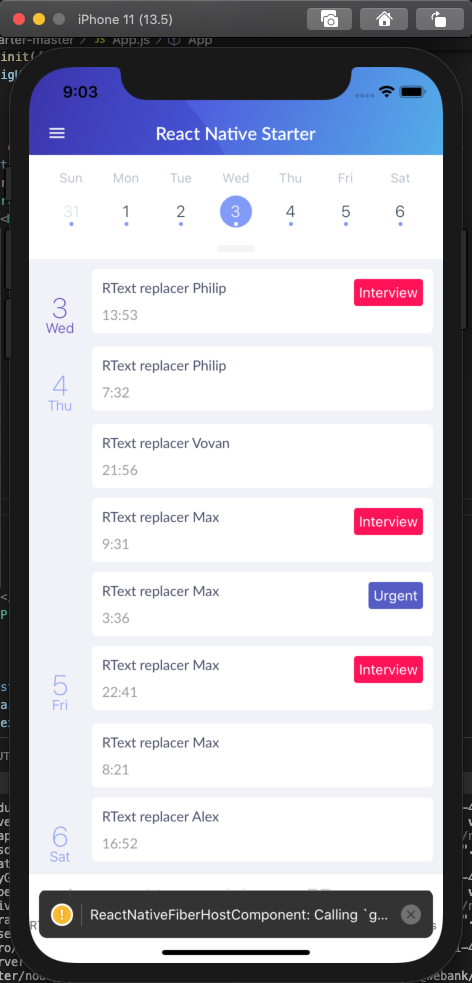

# React Native RText 🚀

这是一个非常强力的，可以通过简单配置(json)，就能修改线上应用文案的杀手级应用。
## 背景
由于我们是金融行业的React Native使用者，而金融行业的特点是对文案的准确性要求特别高。万一哪天线上文案出了问题，往往来不及走打包发版流程，就已经造成不可挽回的损失。

于是，我做出了RText，为的就是能够在紧急情况下救命。
做出来之后，已经在微众银行客户端APP上稳定使用半年，截止目前已经多次救我们于水火。

后来我发现这套实现方案在React Native上非常的通用，因此我进行了简单的改造和抽象，开源出来，协同维护。


## 开始

#### 1. 安装

```bash
# npm
npm i @webank/react-native-rtext --save

# yarn
yarn add @webank/react-native-rtext
```

#### 2. 使用
```javascript
import RText from 'react-native-rtext'

RText.init({
    configUrl: 'http://www.webank.com/cdn/RText.json'
})
```

#### 3. 配置
```JSON
{
  "Calendar": [
    {
      "text": "%Meeting with%",
      "replacement": "%RText replacer%"
    }
  ]
}

```

#### 4. 效果



## 想成为贡献者？
- 先在本Github repo上star一个
- 提pull request，提交bug fixed，提features建议，支持文档建设，通通都欢迎
- 下面是开发流程指引：

#### 1. Clone、安装开发依赖

```bash
# Clone the repo
git clone https://github.com/WeBankFinTech/react-native-rtext.git

# 安装依赖
cd react-native-rtext && yarn install

# 安装Pods
cd ios && pod install
```

#### 2. 在IOS模拟器上打开RNS

```bash
yarn run:ios
```

如果想运行安卓：

```bash
yarn run:android
```
